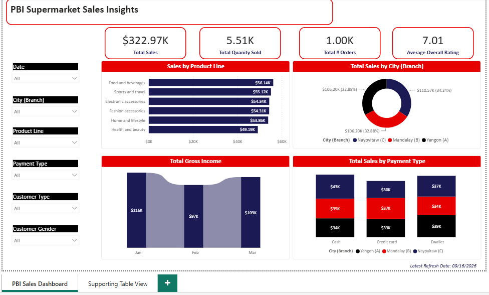
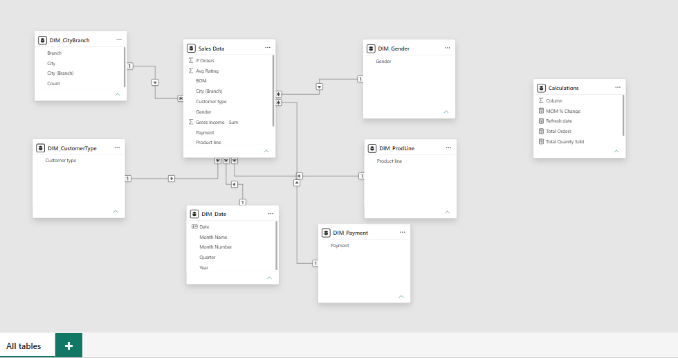
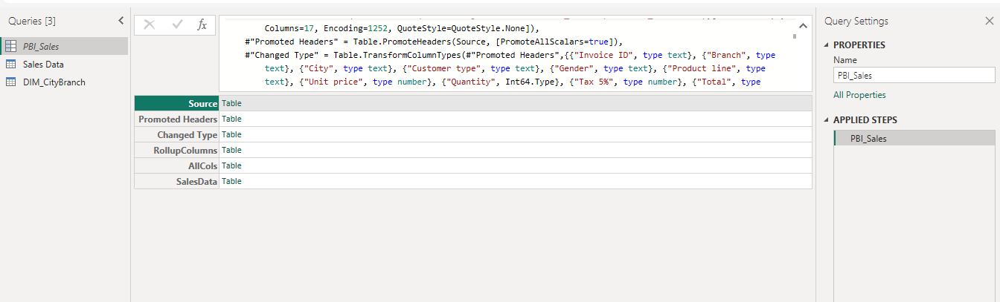
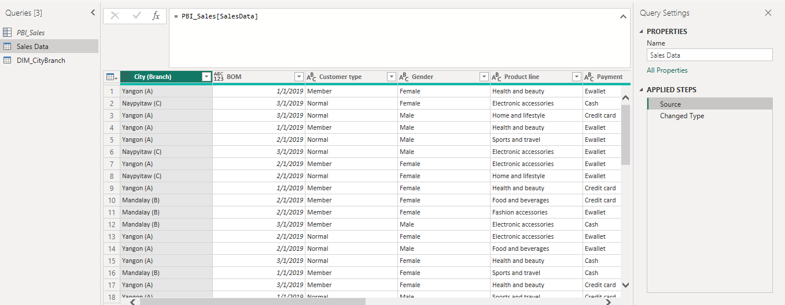
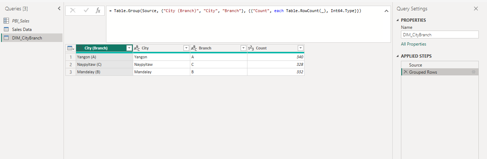
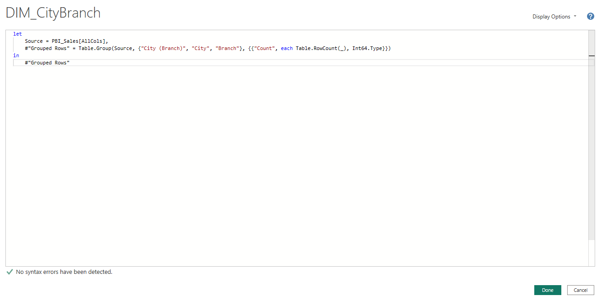
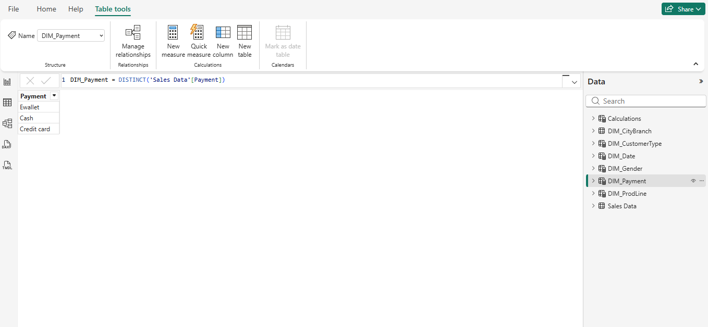
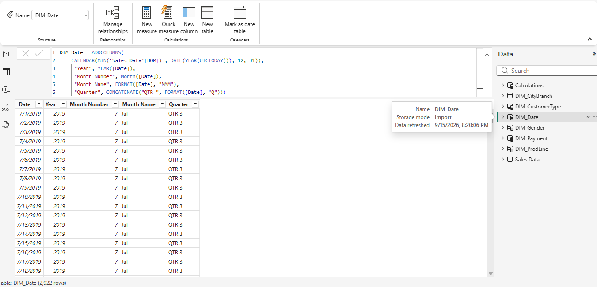
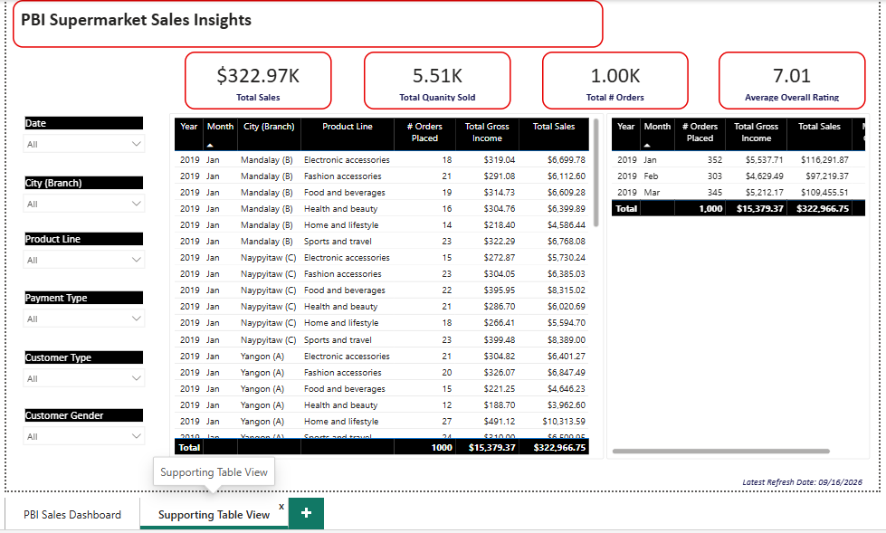

# Power BI — Supermarket Sales Dashboard

A Power BI report analyzing supermarket sales performance across branches, product lines, payment types, and customer segments. Built as a portfolio piece to demonstrate Power Query (M), DAX, and interactive report design in Power BI.



## Contents

- `Supermarket-Sales-Dashboard.pbix` — the Power BI report file (open in Power BI Desktop or upload to Power BI Service to explore)
- `screenshots/` — report pages, data model, and Power Query / DAX views

## Data Model

The report is built on a star schema:



- **Fact table:** `Sales Data` — individual sales transactions (totals, gross income, quantity, ratings, order counts), aggregated from row-level data in Power Query
- **Dimension tables:**
  - `DIM_Date` — Year, Quarter, Month Name, Date (calculated table, see below)
  - `DIM_ProdLine` — Product line
  - `DIM_CityBranch` — City, Branch, City (Branch)
  - `DIM_Payment` — Payment method (calculated table, see below)
  - `DIM_Gender` — Customer gender
  - `DIM_CustomerType` — Customer type
- **Calculations** — a dedicated measures table (no data, just DAX)

## Power Query (M)

Raw transaction-level data is loaded from CSV and rolled up into the `Sales Data` fact table before it ever reaches the model — promoting headers, fixing types, deriving a `City (Branch)` label and a beginning-of-month date, then grouping to a summarized grain:

```m
let
    PBI_Sales = [

    Source = Csv.Document(File.Contents("C:\Data\supermarket_sales.csv"),[Delimiter=",", Columns=17, Encoding=1252, QuoteStyle=QuoteStyle.None]),
    #"Promoted Headers" = Table.PromoteHeaders(Source, [PromoteAllScalars=true]),
    #"Changed Type" = Table.TransformColumnTypes(#"Promoted Headers",{{"Invoice ID", type text}, {"Branch", type text}, {"City", type text}, {"Customer type", type text}, {"Gender", type text}, {"Product line", type text}, {"Unit price", type number}, {"Quantity", Int64.Type}, {"Tax 5%", type number}, {"Total", type number}, {"Date", type date}, {"Time", type time}, {"Payment", type text}, {"cogs", type number}, {"gross margin percentage", type number}, {"gross income", type number}, {"Rating", type number}}),
    #"RollupColumns" = Table.AddColumn(#"Changed Type", "Custom", each [
    #"City (Branch)" = [City] & " (" & [Branch] & ")",
    BOM = Date.StartOfMonth([Date])

]),
    #"AllCols" = Table.ExpandRecordColumn(#"RollupColumns", "Custom", {"City (Branch)", "BOM"}, {"City (Branch)", "BOM"}),
    #"SalesData" = Table.Group(AllCols, {"City (Branch)", "BOM", "Customer type", "Gender", "Product line", "Payment"}, {{"Total - Sum", each List.Sum([Total]), type nullable number}, {"# Orders", each Table.RowCount(_), Int64.Type}, {"Quantity - Sum", each List.Sum([Quantity]), type nullable number}, {"Gross Income - Sum", each List.Sum([gross income]), type nullable number}, {"Avg Rating", each List.Average([Rating]), type nullable number}})
]
in
    PBI_Sales
```

`DIM_CityBranch` is then derived from that same query with a further grouping step:

```m
let
    Source = PBI_Sales[AllCols],
    #"Grouped Rows" = Table.Group(Source, {"City (Branch)", "City", "Branch"}, {{"Count", each Table.RowCount(_), Int64.Type}})
in
    #"Grouped Rows"
```






## DAX

Measures live in a dedicated `Calculations` table:

```dax
Total Sales = CALCULATE(SUM('Sales Data'[Total - Sum]))

Total Quanity Sold = sum('Sales Data'[Quantity - Sum])

Total Orders = sum('Sales Data'[# Orders])

Refresh date = CONCATENATE("Latest Refresh Date: ", FORMAT(UTCNOW(), "mm/dd/yyyy"))

MOM % Change =
DIVIDE(
    ([Total Sales] -
    CALCULATE([Total Sales],
        PREVIOUSMONTH(DIM_Date[Date])
    )),
    CALCULATE([Total Sales], PREVIOUSMONTH(DIM_Date[Date])),
    0
)
```

Two dimension tables are DAX calculated tables rather than Power Query outputs:

```dax
DIM_Payment = DISTINCT('Sales Data'[Payment])

DIM_Date =
ADDCOLUMNS(
    CALENDAR(MIN('Sales Data'[BOM]), DATE(YEAR(UTCTODAY()), 12, 31)),
    "Year", YEAR([Date]),
    "Month Number", MONTH([Date]),
    "Month Name", FORMAT([Date], "MMM"),
    "Quarter", CONCATENATE("QTR ", FORMAT([Date], "Q"))
)
```




## Report Pages

**1. PBI Sales Dashboard**


- KPI cards: total sales, total quantity sold, total orders, average rating, last refresh date
- Clustered bar chart — Sales by Product Line
- Ribbon chart — Total Gross Income by month
- Donut chart — Total Sales by City (Branch)
- Column chart — Total Sales by Payment Type (segmented by branch)
- Slicers for Date, City/Branch, Product Line, Payment, Customer Type, and Gender

**2. Supporting Table View**



- Monthly sales detail table (Year, Month, City/Branch, Product Line, Orders, Gross Income, Total Sales)
- Monthly summary table with running totals
- Matching KPI cards and slicers for consistent filtering

## Tools & Skills Demonstrated

- Power Query (M): CSV ingestion, type transforms, computed columns, multi-key grouping/aggregation
- DAX: iterative measures, time intelligence (`PREVIOUSMONTH`), calculated tables (`DISTINCT`, `CALENDAR`/`ADDCOLUMNS`)
- Star-schema data modeling with a dedicated measures table
- Power BI report design (cards, bar/column/donut/ribbon charts, tables, slicers, cross-filtering, custom branding/theme)

## Viewing the Report

Power BI Desktop is Windows-only. To view this report:
- **Windows:** open the `.pbix` file directly in [Power BI Desktop](https://www.microsoft.com/en-us/power-platform/products/power-bi/downloads) (free)
- **Mac/any OS:** upload the `.pbix` file to the [Power BI Service](https://app.powerbi.com) (free account) and open it in the browser
